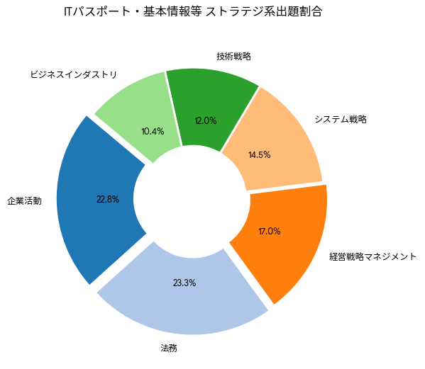

# 第三回 ITパスポート講座 in IT College Okinawa

今回はアウトプットを通じた効率の良い学習方法を学びます。

ITパスポート試験では過去に出た問題の類似問題が頻出します
過去問の出題傾向が以下となっているので重要項目から学習しましょう

## ストラテジー分野出題割合

```txt
出題内容              出題数[問]   割合[%]
--------------------------------------------------------
企業活動                  798      22.8
マーケティング             380      10.9
法務                     817      23.3
企業会計                  425      12.1
システム企画               158       4.5
システム戦略               250       7.1
経営戦略マネジメント         596      17.0
技術戦略マネジメント         76       2.2
--------------------------------------------------------
計            ー         3,500     100.0
```

📊 データの主な特徴2大重要分野：「法務」（23.3%）と「企業活動」（22.8%）の2つだけで、全体の約46%（半分近く）を占めています。試験対策において最優先で学習すべき領域です。準重要分野：次いで「経営戦略マネジメント」（17.0%）、「企業会計」（12.1%）、「マーケティング」（10.9%）が10%を超えており、これらを合わせると全体の約86%に達します。注力度の低い分野：「技術戦略マネジメント」（2.2%）や「システム企画」（4.5%）は出題数が少なく、配点比率も低めです。




前回提示した[ストラテジ分野 最重要用語](./glossary/strategy.md)
はシラバスにそって記述しているので重要分野を優先すると良いでしょう
以前に紹介した[ITパスポート過去問道場](https://www.itpassportsiken.com/ipkakomon.php)は分野別で出題できるので活用しましょう，また[過去問 キーワード検索](https://college.coeteco.jp/itpassport/kakomon/)を使うとキーワードから過去問を引っ張ることができます。この2つのサイトを組み合わせてペアで楽しみながら学習してみましょう

## peer study hands on

1. 2人もしくは3人でグループを作る
2. [ITパスポート過去問道場](https://www.itpassportsiken.com/ipkakomon.php)の分野を指定から企業活動と法務を選択，試験回を絞り込むから
最新3年分を選択
3. グループで話し合い答えを選択する，絞り込める場合は誤答を消す
4. 解答を確認，用語と思われるものを決定
5. [過去問 キーワード検索](https://college.coeteco.jp/itpassport/kakomon/)を用いて他の過去問も解いてみる

## sample examination

過去問をセット問題として解く際には回答の自信度もつけましょう，例えば (1. 全くわからない 2. 2つのうちどちらか 3. 自信あり) のようにします｡
答え合わせの際自信ありで間違った問題と2つのうちどちらかだった問題はその場で修正しましょう。
時計を準備して，本番の半分くらいの時間で解くようにしましょう，読む速度の向上とケアレスミスの予防になります
以下に模擬問題を作りましたので早速やってみてください

## [過去問 ストラテジー分野](https://docs.google.com/forms/d/e/1FAIpQLSfMJhOCPl2VxOfL5Q4huABPOedvOYCUExyMvez5kwjGrL7fmg/viewform?usp=publish-editor)

## まとめ

模擬問題を活用したアウトプット中心の学習方法は、インプットを最小限に抑え、問題を解く過程で知識の漏れや弱点をあぶり出して効率的に記憶を定着させる戦略です。人間の脳は情報を「入力（読む・聞く）」する時よりも、「出力（思い出す・解く）」する時に記憶が強く固定されます。テキストの通読に何時間も費やすよりも、早期に模擬問題へ移行することが試験突破の近道です。具体的な実践ステップと、アウトプット学習を最大化するコツを解説します。

### 🚀 模擬問題アウトプットの4ステップ

#### 1. 最初は「解けなくて当然」で始める

- テキストは全体像を掴む程度（斜め読み）で終わらせる。
- 知識が不十分な状態ですぐに模擬問題に着手する。
- 最初は正答率を一切気にせず、出題傾向を掴む道具と割り切る。

#### 2. 解いた直後に「即」答え合わせをする

- まとめて採点せず、数問ごとに答え合わせをする。
- 記憶が鮮明なうちに解説を読み、記憶のズレを修正する。
- 正解した問題も、理由が合っていたか必ず確認する。

#### 3. 「鶏ガラ学習法」で間違えた問題を以下の3つに分類する

- A：ケアレスミス（次は絶対に解ける）
- B：知識不足（解説を読めば理解できる）
- C：完全な理解不能（基礎に戻る必要がある）

分類後、「B」の知識不足を重点的にテキストや参考書に戻って補強する。

#### 4. エビングハウスの忘却曲線に基づいた反復

- 今日間違えた問題を、明日、3日後、1週間後と間隔を空けて再挑戦する。
- スムーズに解けるようになるまで、最低3〜5回は同じ模擬問題をループする
